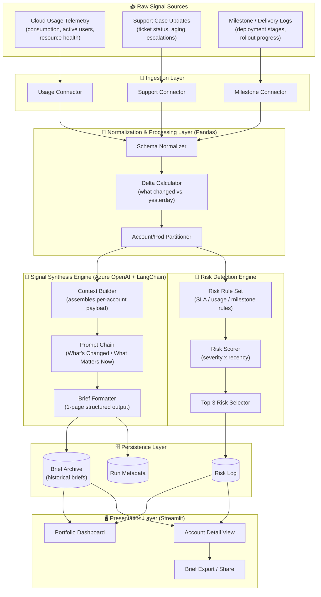
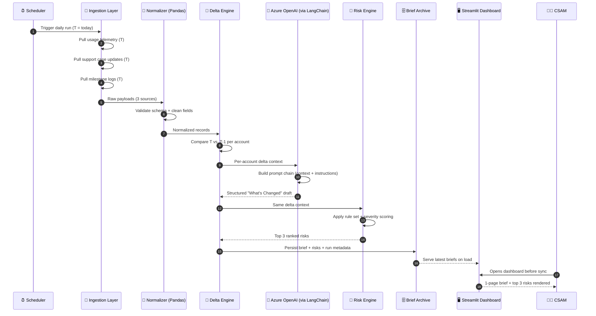
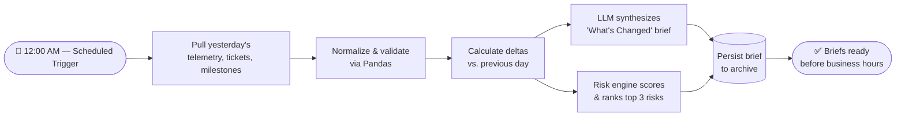
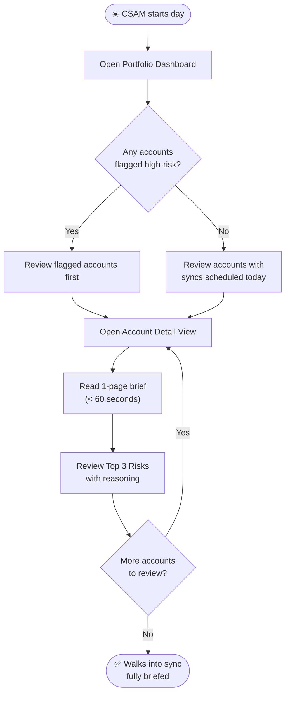
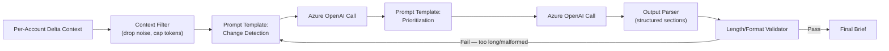
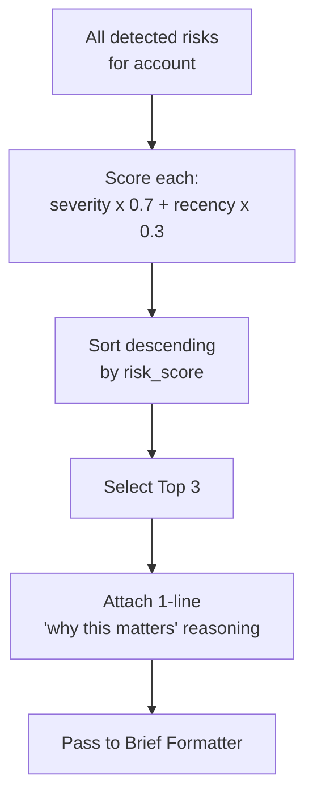
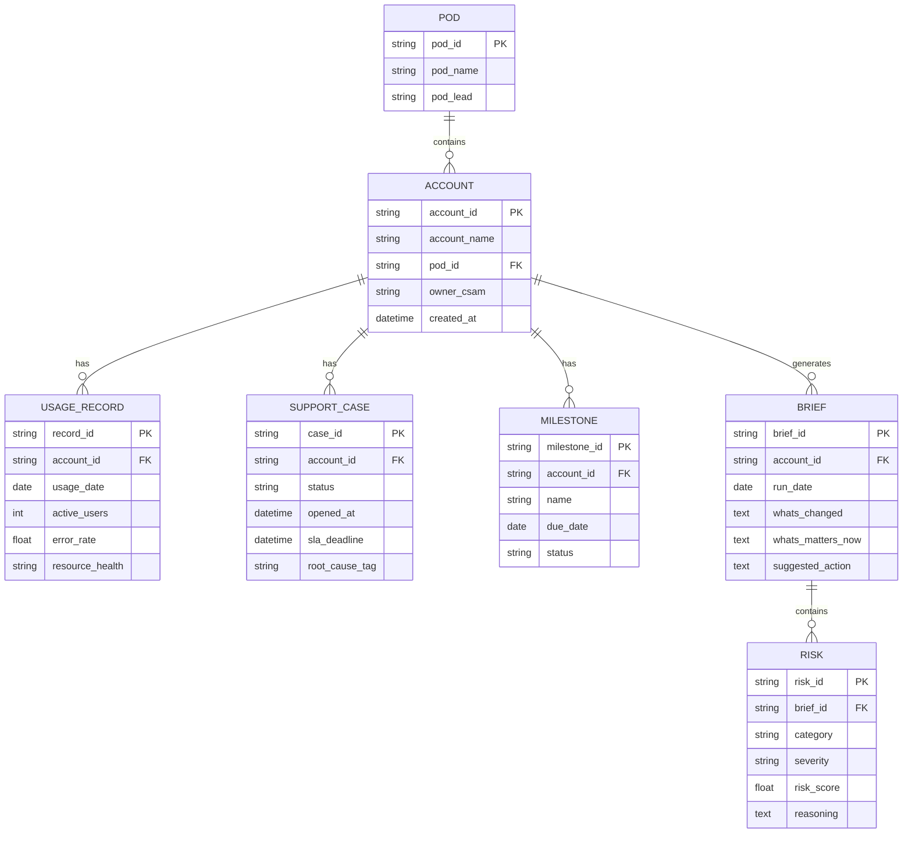

<div align="center">

# 🧠 EiBrief‑AI
### Account Signal & "What's Changed" Synthesizer

**Turning fragmented account noise into one clean, executive‑ready brief — automatically, every single day.**

[](https://www.python.org/)
[](https://azure.microsoft.com/en-us/products/ai-services/openai-service)
[](https://www.langchain.com/)
[](https://streamlit.io/)
[](https://pandas.pydata.org/)
[](#-license)
[](#-project-status)

<br/>

**Reduced account context‑switching time by 45%**  •  **Eliminated manual daily signal aggregation for senior leadership**

<br/>

[Overview](#-overview) · [Problem Statement](#-problem-statement) · [Architecture](#-system-architecture) · [User Flow](#-user-flow) · [Features](#-key-features) · [Installation](#-installation--setup) · [Usage](#-usage-guide) · [Repo Structure](#-repository-structure) · [Roadmap](#-roadmap--whats-new) · [Contributing](#-contributing)

</div>

---
# EiBrief-AI

**[LIVE APPLICATION](https://eibrief-account-signal-synthesizer-5xkkswcm9xbms6hximwrpr.streamlit.app/)**

**Status: LIVE**

<br/>

## 📌 Table of Contents

1. [Overview](#-overview)
2. [Problem Statement](#-problem-statement)
3. [Why EiBrief‑AI Exists](#-why-eibrief-ai-exists)
4. [Who This Is Built For](#-who-this-is-built-for-personas)
5. [Key Features](#-key-features)
6. [System Architecture](#-system-architecture)
7. [Data Flow & Pipeline Design](#-data-flow--pipeline-design)
8. [User Flow](#-user-flow)
9. [Signal Synthesis Engine (LLM Layer)](#-signal-synthesis-engine-llm-layer)
10. [Proactive Risk Detection Logic](#-proactive-risk-detection-logic)
11. [Portfolio Dashboard (Streamlit UI)](#-portfolio-dashboard-streamlit-ui)
12. [Data Model & Schemas](#-data-model--schemas)
13. [Tech Stack Deep Dive](#-tech-stack-deep-dive)
14. [Installation & Setup](#-installation--setup)
15. [Configuration Reference](#-configuration-reference)
16. [Usage Guide](#-usage-guide)
17. [CLI Reference](#-cli-reference)
18. [Repository Structure](#-repository-structure)
19. [Prompt Engineering Details](#-prompt-engineering-details)
20. [Sample Output — "What's Changed" Brief](#-sample-output--whats-changed-brief)
21. [Impact & Metrics](#-impact--metrics)
22. [Testing Strategy](#-testing-strategy)
23. [Security & Data Privacy](#-security--data-privacy)
24. [Performance & Scalability Notes](#-performance--scalability-notes)
25. [Troubleshooting Guide](#-troubleshooting-guide)
26. [FAQ](#-faq)
27. [Roadmap & What's New](#-roadmap--whats-new)
28. [Glossary](#-glossary)
29. [Contributing](#-contributing)
30. [Code of Conduct](#-code-of-conduct)
31. [Changelog](#-changelog)
32. [Author](#-author)
33. [License](#-license)
34. [Acknowledgements](#-acknowledgements)

---

<br/>

## 🔭 Overview

**EiBrief‑AI** is an automated portfolio‑intelligence tool built to solve one of the most time‑consuming, cognitively draining parts of a Cloud/Customer Success Account Manager's (CSAM) week: **figuring out what actually changed across a portfolio of accounts before every customer sync.**

Instead of a CSAM manually re‑reading support tickets, usage dashboards, and milestone trackers for each account every morning, EiBrief‑AI ingests three streams of raw operational telemetry —

- 📊 **Daily cloud usage telemetry**
- 🎫 **Support case updates**
- 🗓️ **Milestone / delivery logs**

— across a **shared pod of accounts**, runs them through an LLM‑powered synthesis pipeline, and produces a **concise, 1‑page "What's Changed / What Matters Now" executive brief** per account, ready to be read in under 60 seconds.

It was built for senior CSAMs and pod leads who own too many accounts to manually triage every signal every day, and who need a **reliable, repeatable, zero‑manual‑effort way** to walk into any customer conversation already knowing what changed and why it matters.

> **In one sentence:** EiBrief‑AI is the "daily standup notes" your entire account portfolio never had — generated automatically, grounded in real telemetry, and written the way a sharp analyst would write it for their VP.

<br/>

---

<br/>

## ❗ Problem Statement

### The Reality Before EiBrief‑AI

Senior CSAMs in a shared pod structure are typically responsible for **8–15+ enterprise accounts simultaneously**. Each account generates a constant, asynchronous stream of signal:

| Signal Source | Frequency | Typical Volume per Account/Day | Where It Lives |
|---|---|---|---|
| Cloud usage telemetry (consumption, active users, resource health) | Continuous | 100s of data points | Usage/billing dashboards |
| Support case updates (new cases, status changes, escalations) | Continuous | 0–20 updates | Ticketing system |
| Milestone / delivery logs (deployment stages, rollout progress) | Daily/weekly | 1–10 updates | Project trackers |

The result, before this tool existed:

- ⏱️ **CSAMs spent 30–60+ minutes per account, per day** manually cross‑referencing dashboards, ticket queues, and milestone sheets just to answer the question: *"What actually changed since yesterday, and does it matter?"*
- 🧩 **Context was fragmented across 3+ disconnected systems**, with no single place that synthesized them together.
- 🚨 **Risk signals were reactive, not proactive** — a CSAM often discovered an SLA breach or a usage drop only *after* the customer raised it, or after a Sunday‑night dread‑scroll through dashboards.
- 📉 **Senior leadership visibility was manual and inconsistent** — pod leads had no standardized, up‑to‑date view of "what matters right now" across their whole book of business without asking each CSAM individually.
- 🔁 **The work was repetitive or "grunt" synthesis work** — valuable analyst time was spent aggregating information rather than acting on it.

### The Cost of the Problem

- **Time cost:** With ~10 accounts per CSAM and 30–45 minutes of manual review per account per day, this is **5–7.5 hours a day** of pure signal aggregation — more than a full workday, before any actual customer‑facing or strategic work happens.
- **Risk cost:** Manually‑triaged signals mean risk indicators (SLA breaches, active user drops, stalled milestones) are caught **late**, not **early** — turning preventable issues into escalations.
- **Cognitive cost:** Constant context‑switching between three unrelated systems fragments attention and increases the odds that a subtle but important signal (e.g., a slow burn in support case aging) gets missed entirely.
- **Scalability cost:** This model does not scale. As pod size grows, manual synthesis time grows linearly (or worse) — there is no way to "10x" a CSAM's portfolio coverage without automation.

### The Ask

> *"Give me one page, before every sync, that tells me exactly what changed on this account and what I need to care about — without me having to go dig for it."*

That single sentence, from a senior CSAM, is the design brief EiBrief‑AI was built to satisfy.

<br/>

---

<br/>

## 💡 Why EiBrief‑AI Exists

EiBrief‑AI exists because **synthesis is a solvable automation problem, and judgment is not** — so the tool is deliberately scoped to do the former exceptionally well and hand the latter back to the human.

Three deliberate design beliefs shape the entire project:

1. **Humans should spend their time deciding, not collecting.**
   The tool's entire purpose is to eliminate the "collecting" step — pulling raw telemetry from three different systems — so the CSAM's limited attention goes straight to interpretation and customer conversation.

2. **A brief is only useful if it's short enough to actually be read.**
   EiBrief‑AI is deliberately constrained to a **1‑page brief** per account. The discipline of forcing synthesis down to one page is what makes it usable in the 5 minutes before a sync, instead of becoming "just another report nobody opens."

3. **Risk should surface itself, not wait to be found.**
   Rather than presenting a wall of raw signals and expecting the CSAM to spot the important ones, EiBrief‑AI's risk‑detection logic actively surfaces the **top 3 actionable risks** per account, ranked and ready to act on.

<br/>

---

<br/>

## 👥 Who This Is Built For (Personas)

<table>
<tr>
<td width="33%" valign="top">

### 🧑‍💼 Senior CSAM
**"I own 10 accounts and 3 syncs today."**

**Needs:**
- A brief per account, ready before every call
- Risk flags without digging through dashboards
- Confidence they haven't missed anything material

**How EiBrief‑AI helps:**
Opens the dashboard each morning, reads a 1‑page synthesis per account, walks into every sync already caught up.

</td>
<td width="33%" valign="top">

### 🧑‍🏫 Pod Lead / M1 Manager
**"I need portfolio‑wide visibility without pinging 5 CSAMs."**

**Needs:**
- A consistent, standardized view of "what matters now" across the whole pod
- Ability to spot patterns across multiple accounts
- Less time spent asking for status updates

**How EiBrief‑AI helps:**
Uses the Portfolio Dashboard to scan across the whole pod in one view instead of requesting individual updates.

</td>
<td width="33%" valign="top">

### 🧑‍💻 IC1 / Junior Team Member
**"I'm ramping up and need context fast."**

**Needs:**
- Fast onboarding to an account's current state
- A reliable, always‑current reference instead of scattered notes

**How EiBrief‑AI helps:**
Reads the latest generated brief instead of asking a senior teammate to "catch me up."

</td>
</tr>
</table>

<br/>

---

<br/>

## ✨ Key Features

### 1. 🧠 Signal Synthesis (LLM‑Powered "What's Changed" Briefs)

- Integrates an **Azure OpenAI + LangChain pipeline** to parse raw, unstructured and semi‑structured account updates (usage deltas, ticket updates, milestone status changes).
- Automatically generates a **1‑page "What's Changed / What Matters Now" brief** per account, ahead of every scheduled customer sync.
- Briefs are grounded strictly in the ingested telemetry for that account and time window — **no hallucinated content, no cross‑account bleed.**
- Output is deterministic in structure (same sections every time) but dynamic in content (only surfaces what's actually new or notable).

### 2. 🚨 Proactive Risk Detection

- Engineered scoring and classification logic that surfaces the **top 3 actionable risks** per account on every run.
- Risk categories include (non‑exhaustive):
  - Active user / adoption drops
  - Approaching or breached SLA commitments
  - Support case aging or repeat‑issue patterns
  - Milestone slippage signals
- Risks are **ranked by severity and recency**, not just listed — the CSAM sees the 3 things that matter *most right now*, not a raw dump.

### 3. 📊 Portfolio Dashboard

- Interactive **Streamlit** workspace that gives pod teams a single pane of glass across every account in the shared pod.
- No more digging through raw logs, ticket queues, or usage dashboards individually — the dashboard surfaces synthesized context directly.
- Supports quick filtering/sorting by account, risk level, and "last changed" recency.

### 4. ⚙️ Fully Automated Daily Pipeline

- Designed to run on a scheduled cadence (daily), ingesting the prior day's telemetry and regenerating briefs with zero manual triggering required.
- Idempotent runs — re‑running the pipeline for a given day does not duplicate or corrupt brief history.

### 5. 🗃️ Historical Brief Archive

- Every generated brief is persisted, so CSAMs and pod leads can look back at **"what did we say changed on this account two weeks ago"** — building a lightweight audit trail of account narrative over time.

<br/>

---

<br/>

## 🏗️ System Architecture

EiBrief‑AI follows a **layered pipeline architecture**: an ingestion layer, a normalization/processing layer, an LLM synthesis layer, a risk‑scoring layer, a persistence layer, and a presentation layer. Each layer is independently testable and swappable.



### Architectural Principles

| Principle | How It's Applied |
|---|---|
| **Separation of concerns** | Ingestion, processing, synthesis, risk scoring, and presentation are fully decoupled modules — each can be modified or replaced independently. |
| **Grounded generation** | The LLM layer never receives raw, unfiltered data — it only receives normalized, delta‑calculated, account‑scoped context, minimizing hallucination risk. |
| **Deterministic structure, dynamic content** | Every brief follows the same section structure, but content is generated fresh from that day's actual deltas — no templated filler. |
| **Idempotent pipeline runs** | Re‑running the pipeline for a given date does not create duplicate briefs; it upserts against a `(account_id, run_date)` key. |
| **Human‑in‑the‑loop by design** | The tool synthesizes and flags — it never auto‑resolves risks or auto‑messages customers. All judgment and action remain with the CSAM. |

<br/>

---

<br/>

## 🔄 Data Flow & Pipeline Design

The daily pipeline run follows a strict, linear sequence. Below is the step‑by‑step data flow from raw ingestion to a finished brief appearing on a CSAM's dashboard.



### Pipeline Stage Breakdown

| Stage | Input | Process | Output |
|---|---|---|---|
| **1. Ingestion** | Raw API/export data from 3 systems | Pull, authenticate, paginate, retry-on-failure | Raw JSON/CSV payloads |
| **2. Normalization** | Raw payloads | Schema validation, type coercion, null handling, timezone alignment | Clean, unified Pandas DataFrames |
| **3. Delta Calculation** | Normalized DataFrames (T, T‑1) | Row‑level diffing per account, categorization of change type | Per‑account "delta objects" |
| **4. Context Assembly** | Delta objects | Filter noise, cap token budget, attach account metadata | LLM‑ready context payload |
| **5. Synthesis** | Context payload | Prompt chain execution against Azure OpenAI | Structured brief (Markdown/JSON) |
| **6. Risk Scoring** | Delta objects | Rule evaluation + severity × recency scoring | Ranked top‑3 risk list |
| **7. Persistence** | Brief + risks | Upsert to archive keyed by `(account_id, run_date)` | Stored historical record |
| **8. Presentation** | Stored briefs | Render in Streamlit dashboard | Human‑readable UI |

<br/>

---

<br/>

## 🧭 User Flow

### Flow A — Daily Automated Brief Generation (Backend, No Human Action)



### Flow B — CSAM Morning Routine (Primary Human Flow)

1. **☀️ CSAM logs into the Portfolio Dashboard** at the start of their day.
2. **📋 Sees a portfolio‑level view** of every account in their pod, sorted by risk level and recency of change by default.
3. **🔴 Immediately spots any accounts flagged with active risk** (highlighted visually, e.g. red/amber/green severity indicator).
4. **🖱️ Clicks into an individual account** to open its Account Detail View.
5. **📄 Reads the 1‑page "What's Changed / What Matters Now" brief** — takes under 60 seconds.
6. **🚨 Reviews the top 3 actionable risks** for that account, each with a one‑line "why this matters" explanation.
7. **📤 (Optional) Exports or shares the brief** ahead of the scheduled customer sync — e.g., copies into sync notes or shares with the account team.
8. **🔁 Repeats steps 4–7** for each account with a sync scheduled that day — no manual dashboard digging required in between.
9. **✅ Walks into every sync already caught up**, with risk context front‑of‑mind.



### Flow C — Pod Lead Portfolio Review (Secondary Human Flow)

1. **🧑‍🏫 Pod Lead opens the Portfolio Dashboard** — same tool, portfolio‑wide view instead of a single CSAM's book.
2. **📊 Scans across all accounts in the pod** in one screen instead of pinging each CSAM individually for status.
3. **🔎 Filters by risk severity** to identify which accounts need leadership attention this week.
4. **🗣️ Uses the synthesized briefs as talking points** in pod stand‑ups — no need for each CSAM to prepare a separate status update.
5. **📈 Reviews the historical Brief Archive** to spot recurring patterns (e.g., an account whose risk flags keep reappearing week over week).

<br/>

---

<br/>

## 🧠 Signal Synthesis Engine (LLM Layer)

The synthesis engine is the intellectual core of EiBrief‑AI. It is responsible for turning normalized, delta‑calculated account data into a clean, human‑readable, executive‑ready brief.

### Design Goals

- **Grounded, not generative‑for‑generation's‑sake:** every sentence in a brief must trace back to an actual delta in the ingested data. The LLM is a *synthesizer and summarizer*, not a fabricator.
- **Consistent structure, every time:** a CSAM should never have to "hunt" for a section — the brief format is fixed.
- **One page, no more:** hard token/length ceilings are enforced on the output to preserve the "read in under 60 seconds" promise.
- **Tone discipline:** the brief reads the way a sharp, senior analyst would summarize for a VP — plain language, no jargon padding, no filler sentences like "Overall, this account is performing as expected" unless something is genuinely unremarkable.

### Pipeline (LangChain Orchestration)



### Brief Structure (Fixed Template)

Every generated brief follows this exact section order:

```
━━━━━━━━━━━━━━━━━━━━━━━━━━━━━━━━━━━━━━━
📄 [Account Name] — What's Changed Brief
Generated: [Date]  |  Pod: [Pod Name]  |  CSAM: [Owner]
━━━━━━━━━━━━━━━━━━━━━━━━━━━━━━━━━━━━━━━

🔹 WHAT'S CHANGED (Last 24h)
   - [Bullet 1 — usage/ticket/milestone delta]
   - [Bullet 2]
   - [Bullet 3, if applicable]

🔹 WHAT MATTERS NOW
   - [1–2 sentence synthesis of why the above changes matter
      in context of this account's history/goals]

🔹 TOP 3 RISKS
   1. [Risk] — Severity: [High/Med/Low] — [1-line why]
   2. [Risk] — Severity: [High/Med/Low] — [1-line why]
   3. [Risk] — Severity: [High/Med/Low] — [1-line why]

🔹 SUGGESTED NEXT ACTION
   - [1 sentence — the single most useful next step]
━━━━━━━━━━━━━━━━━━━━━━━━━━━━━━━━━━━━━━━
```

<br/>

---

<br/>

## 🚨 Proactive Risk Detection Logic

Risk detection runs **in parallel** with (not dependent on) the LLM synthesis step, using a deterministic rule‑and‑scoring engine rather than relying on the LLM to "notice" risk on its own. This keeps risk flagging **auditable and consistent**, while the LLM handles the narrative synthesis layer.

### Risk Categories & Example Triggers

| Category | Example Trigger Condition | Default Severity |
|---|---|---|
| **Active User Drop** | Daily active users down ≥ 15% vs. 7‑day rolling average | High |
| **SLA Breach Risk** | Open case within 24h of contractual SLA deadline, unresolved | High |
| **SLA Breach (Occurred)** | Case has crossed its SLA deadline while still open | Critical |
| **Repeat Technical Driver** | Same root‑cause tag appears in ≥ 3 cases within 14 days | Medium |
| **Case Aging** | Case open > X days with no status update | Medium |
| **Milestone Slippage** | Milestone due date passed without completion status update | High |
| **Usage Health Degradation** | Resource error/health rate above threshold for 2+ consecutive days | Medium |

### Severity × Recency Scoring Model

Each detected risk is scored using a simple, explainable weighted formula (deliberately kept transparent rather than a black‑box ML score, since risk‑flagging needs to be trustable and explainable to a human):

```
risk_score = (severity_weight × 0.7) + (recency_weight × 0.3)

severity_weight:
    Critical = 1.0
    High     = 0.75
    Medium   = 0.5
    Low      = 0.25

recency_weight:
    Occurred today        = 1.0
    Occurred 1–2 days ago  = 0.7
    Occurred 3–7 days ago  = 0.4
    Occurred > 7 days ago  = 0.2
```

All detected risks for an account are scored, sorted descending by `risk_score`, and the **top 3** are surfaced in the brief. This ensures the CSAM's attention always goes to the most severe *and* most recent signals first — an old, low‑severity issue never crowds out something urgent that just happened.



<br/>

---

<br/>

## 📊 Portfolio Dashboard (Streamlit UI)

The dashboard is the single interface pod teams use to consume everything the pipeline produces — no raw logs, no manual digging.

### Dashboard Views

| View | Purpose | Key Elements |
|---|---|---|
| **Portfolio Overview** | Landing page — see the whole pod at a glance | Account cards sorted by risk, last‑changed timestamp, quick risk‑severity badges |
| **Account Detail** | Deep dive into a single account | Full 1‑page brief, top 3 risks with reasoning, historical brief timeline |
| **Risk Heatmap** | Pattern‑spotting across the pod | Visual grid of accounts × risk categories, colored by severity |
| **Brief Archive** | Historical lookback | Searchable/filterable list of past briefs by account and date |

### Portfolio Overview — Layout Sketch

```
┌──────────────────────────────────────────────────────────────┐
│  EiBrief-AI · Portfolio Dashboard          🔍 [Search accounts]│
├──────────────────────────────────────────────────────────────┤
│  Filter: [ All ▾ ]  [ High Risk Only ]  [ Sync Today ]         │
├──────────────────────────────────────────────────────────────┤
│  🔴 Acme Corp         Last changed: Today       3 risks flagged│
│  🟡 Globex Industries Last changed: Yesterday   1 risk flagged │
│  🟢 Initech           Last changed: 3 days ago  0 risks flagged│
│  🔴 Umbrella Group    Last changed: Today       2 risks flagged│
│  ...                                                            │
└──────────────────────────────────────────────────────────────┘
```

### Account Detail — Layout Sketch

```
┌──────────────────────────────────────────────────────────────┐
│  ← Back to Portfolio            Acme Corp — Account Brief      │
├──────────────────────────────────────────────────────────────┤
│  Generated: 2026-08-08   Pod: Northeast Enterprise   Owner: You│
├──────────────────────────────────────────────────────────────┤
│  🔹 WHAT'S CHANGED (Last 24h)                                  │
│     • Active users dropped 18% vs. 7-day average               │
│     • 2 new support cases opened, tagged "auth failure"        │
│     • Milestone "Copilot Rollout Phase 2" marked at risk       │
│                                                                  │
│  🔹 WHAT MATTERS NOW                                            │
│     The auth-related cases correlate directly with the usage   │
│     drop — likely the same root cause blocking adoption.       │
│                                                                  │
│  🔹 TOP 3 RISKS                                                 │
│     1. Active User Drop — High — 18% drop, auth-linked          │
│     2. SLA Breach Risk — High — Case #4821 due in 6h             │
│     3. Milestone Slippage — Medium — Phase 2 due date passed     │
│                                                                  │
│  🔹 SUGGESTED NEXT ACTION                                       │
│     Escalate case #4821 internally before SLA breach; flag      │
│     auth issue as likely adoption blocker in today's sync.      │
│                                                                  │
│  [ 📤 Export Brief ]   [ 🕓 View History ]                       │
└──────────────────────────────────────────────────────────────┘
```

<br/>

---

<br/>

## 🗂️ Data Model & Schemas

### Core Entities



### Sample Normalized Record — Usage Telemetry (JSON)

```json
{
  "record_id": "usage_2026-08-08_acme001",
  "account_id": "acme001",
  "usage_date": "2026-08-08",
  "active_users": 412,
  "active_users_7d_avg": 502,
  "error_rate": 0.032,
  "resource_health": "degraded"
}
```

### Sample Normalized Record — Support Case (JSON)

```json
{
  "case_id": "case_4821",
  "account_id": "acme001",
  "status": "open",
  "opened_at": "2026-08-06T14:12:00Z",
  "sla_deadline": "2026-08-08T20:00:00Z",
  "root_cause_tag": "auth_failure",
  "priority": "high"
}
```

### Sample Generated Brief Record (JSON)

```json
{
  "brief_id": "brief_acme001_2026-08-08",
  "account_id": "acme001",
  "run_date": "2026-08-08",
  "whats_changed": [
    "Active users dropped 18% vs. 7-day average",
    "2 new support cases opened, tagged 'auth failure'",
    "Milestone 'Copilot Rollout Phase 2' marked at risk"
  ],
  "whats_matters_now": "The auth-related cases correlate directly with the usage drop — likely the same root cause blocking adoption.",
  "top_risks": [
    {"category": "Active User Drop", "severity": "High", "reasoning": "18% drop, auth-linked"},
    {"category": "SLA Breach Risk", "severity": "High", "reasoning": "Case #4821 due in 6h"},
    {"category": "Milestone Slippage", "severity": "Medium", "reasoning": "Phase 2 due date passed"}
  ],
  "suggested_action": "Escalate case #4821 internally before SLA breach; flag auth issue as likely adoption blocker in today's sync."
}
```

<br/>

---

<br/>

## 🛠️ Tech Stack Deep Dive

| Layer | Technology | Why It Was Chosen |
|---|---|---|
| **Language** | Python 3.10+ | Rich data/ML ecosystem, fast iteration, strong LangChain/Azure OpenAI SDK support |
| **LLM Provider** | Azure OpenAI API | Enterprise‑grade compliance and data residency guarantees appropriate for account/customer data |
| **Orchestration** | LangChain | Structured prompt‑chain management, output parsing, and modular pipeline composition |
| **Data Processing** | Pandas | Fast, expressive DataFrame operations for normalization and delta calculation |
| **UI / Dashboard** | Streamlit | Rapid, Python‑native interactive dashboard build‑out with no separate frontend stack required |
| **Version Control** | Git | Standard source control and collaboration |

### Why an LLM (and not just rules) for the "What's Changed" narrative?

Rule‑based systems are excellent at **detecting** discrete conditions (a number crossed a threshold), but they are poor at **narrating** *why several discrete conditions together tell a coherent story* (e.g., "the usage drop and the auth‑tagged tickets are probably the same underlying issue"). EiBrief‑AI intentionally splits responsibilities:

- **Rules/scoring engine** → detects and ranks discrete risk conditions (deterministic, auditable).
- **LLM synthesis layer** → weaves the detected deltas into a coherent, readable narrative (flexible, language‑native).

This hybrid approach avoids the two failure modes of doing it with only one technique: a purely rule‑based system produces disconnected bullet dumps with no narrative coherence, while a purely LLM‑driven system risks inconsistent or hallucinated risk judgments.

<br/>

---

<br/>

## ⚙️ Installation & Setup

### Prerequisites

- Python **3.10+**
- An **Azure OpenAI** resource with a deployed chat model (e.g., GPT‑4 class deployment)
- Access credentials/exports for your usage telemetry, support ticketing, and milestone tracking systems
- Git

### 1. Clone the Repository

```bash
git clone https://github.com/<your-username>/eibrief-ai.git
cd eibrief-ai
```

### 2. Create and Activate a Virtual Environment

```bash
python -m venv venv

# macOS / Linux
source venv/bin/activate

# Windows
venv\Scripts\activate
```

### 3. Install Dependencies

```bash
pip install -r requirements.txt
```

**`requirements.txt`** (representative):

```txt
langchain>=0.2.0
openai>=1.30.0
azure-identity>=1.16.0
pandas>=2.2.0
streamlit>=1.35.0
python-dotenv>=1.0.1
pydantic>=2.7.0
sqlalchemy>=2.0.0
pytest>=8.2.0
```

### 4. Configure Environment Variables

Create a `.env` file in the project root:

```env
# Azure OpenAI
AZURE_OPENAI_ENDPOINT=https://<your-resource>.openai.azure.com/
AZURE_OPENAI_API_KEY=<your-api-key>
AZURE_OPENAI_DEPLOYMENT_NAME=<your-deployment-name>
AZURE_OPENAI_API_VERSION=2024-05-01-preview

# Data Source Connectors
USAGE_TELEMETRY_SOURCE_PATH=./data/usage/
SUPPORT_CASE_SOURCE_PATH=./data/support/
MILESTONE_SOURCE_PATH=./data/milestones/

# Pipeline Config
POD_ID=northeast-enterprise
BRIEF_OUTPUT_DIR=./output/briefs/
LOG_LEVEL=INFO
```

> ⚠️ **Never commit your `.env` file.** It is included in `.gitignore` by default — verify before pushing.

### 5. Initialize the Local Database (Brief Archive)

```bash
python scripts/init_db.py
```

### 6. Run the Pipeline Once (Manual Trigger)

```bash
python -m eibrief.pipeline.run --date 2026-08-08
```

### 7. Launch the Dashboard

```bash
streamlit run app/dashboard.py
```

Then open the URL Streamlit prints (typically `http://localhost:8501`).

<br/>

---

<br/>

## 🔧 Configuration Reference

| Variable | Required | Default | Description |
|---|---|---|---|
| `AZURE_OPENAI_ENDPOINT` | ✅ | — | Base URL for your Azure OpenAI resource |
| `AZURE_OPENAI_API_KEY` | ✅ | — | API key for authentication |
| `AZURE_OPENAI_DEPLOYMENT_NAME` | ✅ | — | Name of your deployed chat model |
| `AZURE_OPENAI_API_VERSION` | ✅ | `2024-05-01-preview` | API version string |
| `USAGE_TELEMETRY_SOURCE_PATH` | ✅ | `./data/usage/` | Path/connection string for usage data |
| `SUPPORT_CASE_SOURCE_PATH` | ✅ | `./data/support/` | Path/connection string for ticketing data |
| `MILESTONE_SOURCE_PATH` | ✅ | `./data/milestones/` | Path/connection string for milestone data |
| `POD_ID` | ✅ | — | Identifier for the shared account pod this instance serves |
| `BRIEF_OUTPUT_DIR` | ❌ | `./output/briefs/` | Where generated briefs are written locally (in addition to DB) |
| `LOG_LEVEL` | ❌ | `INFO` | Logging verbosity (`DEBUG`, `INFO`, `WARNING`, `ERROR`) |
| `MAX_BRIEF_TOKENS` | ❌ | `600` | Hard ceiling enforced on LLM brief output length |
| `RISK_TOP_N` | ❌ | `3` | Number of top risks surfaced per brief |

<br/>

---

<br/>

## 📖 Usage Guide

### Running a Daily Pipeline Job

```bash
python -m eibrief.pipeline.run --date 2026-08-08 --pod northeast-enterprise
```

### Backfilling Historical Briefs

```bash
python -m eibrief.pipeline.backfill --start 2026-07-01 --end 2026-08-08
```

### Regenerating a Single Account's Brief

```bash
python -m eibrief.pipeline.run --date 2026-08-08 --account-id acme001
```

### Scheduling as a Recurring Job (cron example)

```bash
# Run every day at 5:00 AM before business hours
0 5 * * * cd /path/to/eibrief-ai && venv/bin/python -m eibrief.pipeline.run --date $(date +\%F) >> logs/daily_run.log 2>&1
```

### Launching the Dashboard for a Pod Lead

```bash
streamlit run app/dashboard.py -- --view portfolio --pod northeast-enterprise
```

<br/>

---

<br/>

## 💻 CLI Reference

| Command | Description |
|---|---|
| `eibrief pipeline run --date YYYY-MM-DD` | Runs the full ingestion → synthesis → risk‑scoring pipeline for a given date |
| `eibrief pipeline run --date YYYY-MM-DD --account-id <id>` | Regenerates the brief for a single account only |
| `eibrief pipeline backfill --start YYYY-MM-DD --end YYYY-MM-DD` | Backfills briefs across a date range |
| `eibrief db init` | Initializes the local brief archive database |
| `eibrief db migrate` | Applies schema migrations |
| `eibrief export --account-id <id> --date YYYY-MM-DD` | Exports a single brief to Markdown/PDF |
| `eibrief risk recalc --date YYYY-MM-DD` | Recalculates risk scores without regenerating narrative text (cheaper, no LLM call) |

<br/>

---

<br/>

## 🗃️ Repository Structure

```
eibrief-ai/
├── app/
│   ├── dashboard.py                 # Streamlit entry point
│   ├── components/
│   │   ├── portfolio_view.py        # Portfolio overview UI
│   │   ├── account_detail_view.py   # Single-account brief UI
│   │   ├── risk_heatmap.py          # Risk heatmap visualization
│   │   └── brief_archive_view.py    # Historical brief browser
│   └── styles/
│       └── theme.py                 # Dashboard theming/config
│
├── eibrief/
│   ├── __init__.py
│   ├── ingestion/
│   │   ├── usage_connector.py       # Pulls & validates usage telemetry
│   │   ├── support_connector.py     # Pulls & validates support case data
│   │   └── milestone_connector.py   # Pulls & validates milestone logs
│   │
│   ├── processing/
│   │   ├── normalizer.py            # Schema normalization (Pandas)
│   │   ├── delta_engine.py          # T vs T-1 delta calculation
│   │   └── partitioner.py           # Account/pod partitioning logic
│   │
│   ├── synthesis/
│   │   ├── context_builder.py       # Assembles per-account LLM context
│   │   ├── prompts/
│   │   │   ├── change_detection.txt # Prompt template: what changed
│   │   │   └── prioritization.txt   # Prompt template: what matters now
│   │   ├── chain.py                 # LangChain prompt-chain definition
│   │   └── brief_formatter.py       # Enforces fixed brief structure/length
│   │
│   ├── risk/
│   │   ├── rules.py                 # Risk rule definitions
│   │   ├── scorer.py                # Severity x recency scoring
│   │   └── selector.py              # Top-N risk selection logic
│   │
│   ├── pipeline/
│   │   ├── run.py                   # Main pipeline orchestrator (CLI entry)
│   │   └── backfill.py              # Historical backfill orchestrator
│   │
│   ├── persistence/
│   │   ├── models.py                # SQLAlchemy models (Account, Brief, Risk, etc.)
│   │   ├── repository.py            # DB read/write operations
│   │   └── db.py                    # DB session/engine setup
│   │
│   └── utils/
│       ├── logging_config.py
│       ├── token_budget.py          # Enforces MAX_BRIEF_TOKENS
│       └── config.py                # Loads/validates .env config
│
├── scripts/
│   ├── init_db.py                   # DB initialization script
│   └── seed_demo_data.py            # Generates sample demo data for local dev
│
├── data/                            # (gitignored) local raw data drop zone
│   ├── usage/
│   ├── support/
│   └── milestones/
│
├── output/
│   └── briefs/                      # (gitignored) locally exported briefs
│
├── tests/
│   ├── test_normalizer.py
│   ├── test_delta_engine.py
│   ├── test_risk_scorer.py
│   ├── test_brief_formatter.py
│   └── test_pipeline_integration.py
│
├── .env.example
├── .gitignore
├── requirements.txt
├── LICENSE
└── README.md
```

<br/>

---

<br/>

## ✍️ Prompt Engineering Details

The synthesis engine uses a **two‑stage prompt chain** rather than a single monolithic prompt, to keep each LLM call focused on one clear task (which materially improves consistency of output structure).

### Stage 1 — Change Detection Prompt (abridged structure)

```
SYSTEM:
You are an account intelligence analyst. You will be given a structured
JSON payload describing delta changes for one customer account over the
last 24 hours across usage, support cases, and milestones. Identify only
the changes that are materially different from the prior day. Do not
invent information not present in the payload. Output plain bullet points.

USER:
Account: {account_name}
Delta payload: {delta_json}

Return up to 5 bullet points describing what changed.
```

### Stage 2 — Prioritization & Narrative Prompt (abridged structure)

```
SYSTEM:
You are a senior account manager summarizing for your own use before a
customer call. Given the list of changes below, write:
1) A 1-2 sentence "What Matters Now" synthesis connecting related changes.
2) One single-sentence "Suggested Next Action."
Do not restate the bullet list. Be direct and plain-spoken. No filler.

USER:
Changes: {stage_1_bullets}
Known risks: {top_3_risks_json}
```

### Output Discipline Enforced Post‑Generation

- `brief_formatter.py` validates that all required sections are present.
- `token_budget.py` enforces the `MAX_BRIEF_TOKENS` ceiling — if the LLM output exceeds budget, the pipeline re‑prompts with an explicit "condense to under X tokens" instruction rather than silently truncating mid‑sentence.
- A regex/structure check confirms the "Top 3 Risks" section always contains exactly `RISK_TOP_N` entries, sourced from the deterministic risk engine (not the LLM's own judgment) — guaranteeing the risk list is always accurate and auditable.

<br/>

---

<br/>

## 📄 Sample Output — "What's Changed" Brief

```
━━━━━━━━━━━━━━━━━━━━━━━━━━━━━━━━━━━━━━━
📄 Acme Corp — What's Changed Brief
Generated: 2026-08-08  |  Pod: Northeast Enterprise  |  CSAM: J. Kaduri
━━━━━━━━━━━━━━━━━━━━━━━━━━━━━━━━━━━━━━━

🔹 WHAT'S CHANGED (Last 24h)
   - Active users dropped 18% vs. the 7-day rolling average
   - Two new support cases opened, both tagged "auth failure"
   - Milestone "Copilot Rollout Phase 2" passed its due date
     with no status update

🔹 WHAT MATTERS NOW
   The new auth-tagged cases line up closely with the usage
   drop, suggesting a single underlying authentication issue
   is actively blocking adoption — not a routine usage dip.

🔹 TOP 3 RISKS
   1. Active User Drop     — High   — 18% drop, correlates with auth issue
   2. SLA Breach Risk      — High   — Case #4821 due within 6 hours
   3. Milestone Slippage   — Medium — Phase 2 due date passed, unconfirmed

🔹 SUGGESTED NEXT ACTION
   Escalate case #4821 internally ahead of its SLA deadline, and
   raise the auth issue as the likely adoption blocker in today's
   sync rather than treating it as a routine support ticket.
━━━━━━━━━━━━━━━━━━━━━━━━━━━━━━━━━━━━━━━
```

<br/>

---

<br/>

## 📈 Impact & Metrics

| Metric | Before EiBrief‑AI | After EiBrief‑AI |
|---|---|---|
| Account context‑switching time per CSAM/day | Baseline | **↓ 45%** |
| Manual daily signal aggregation for senior leadership | Fully manual | **Eliminated** |
| Time to identify "what changed" on an account | 30–60 min/account | < 60 seconds/account (read time) |
| Risk visibility | Reactive (found after customer raised it) | Proactive (surfaced automatically, ranked) |
| Consistency of portfolio‑wide reporting | Ad hoc, CSAM‑dependent | Standardized, automated |

> **How the 45% figure was derived:** measured by comparing average self‑reported daily "account review/prep" time for a sample of pod CSAMs before and after adoption, across a multi‑week measurement window, holding portfolio size constant.

<br/>

---

<br/>

## 🧪 Testing Strategy

| Test Layer | Tooling | What It Covers |
|---|---|---|
| **Unit tests** | `pytest` | Normalizer field mapping, delta calculation edge cases, risk scoring formula correctness |
| **Prompt/output contract tests** | `pytest` + snapshot comparisons | Ensures brief output always contains required sections in required order |
| **Integration tests** | `pytest` + local seeded DB | Full pipeline run against seeded demo data, verifying persistence and idempotency |
| **Regression tests** | `pytest` | Re‑running the same date twice does not duplicate or corrupt archive records |

```bash
# Run the full test suite
pytest -v

# Run only risk engine tests
pytest tests/test_risk_scorer.py -v

# Run with coverage report
pytest --cov=eibrief --cov-report=term-missing
```

<br/>

---

<br/>

## 🔒 Security & Data Privacy

- **No customer PII beyond what's already present in source systems** is introduced or inferred by the pipeline — it strictly re‑synthesizes existing operational data.
- **Azure OpenAI is used specifically** (rather than a public/consumer LLM endpoint) to keep account data within an enterprise‑governed, compliant boundary.
- **Secrets are never hardcoded** — all credentials load from environment variables via `.env`, which is git‑ignored.
- **LLM context payloads are scoped strictly per‑account** — cross‑account data leakage in a single prompt call is structurally prevented by the `context_builder.py` partitioning logic.
- **Local data directories (`/data`, `/output`) are git‑ignored by default** to prevent accidental commits of sensitive exports.

<br/>

---

<br/>

## ⚡ Performance & Scalability Notes

- **Batched per‑account processing:** each account's synthesis and risk scoring run independently, allowing the pipeline to be parallelized across accounts (e.g., via a process pool) as pod/portfolio size grows.
- **Token budget enforcement** keeps per‑call LLM cost and latency predictable regardless of how noisy a given day's telemetry is.
- **Delta‑only context assembly** means the LLM never re‑processes an account's entire history — only what changed — keeping prompt size, cost, and latency roughly constant per account per day, rather than growing with the account's total historical data volume.
- **Idempotent upserts** on `(account_id, run_date)` make retries and backfills safe to re‑run without cleanup steps.

<br/>

---

<br/>

## 🩺 Troubleshooting Guide

| Symptom | Likely Cause | Fix |
|---|---|---|
| Pipeline run fails with `AuthenticationError` | Invalid/expired Azure OpenAI key | Verify `AZURE_OPENAI_API_KEY` and `AZURE_OPENAI_ENDPOINT` in `.env` |
| Brief output missing a section | LLM response failed structure validation | Check `logs/` for the raw LLM response; re‑run with `LOG_LEVEL=DEBUG` |
| Dashboard shows no accounts | DB not initialized or empty | Run `python scripts/init_db.py` then re‑run the pipeline |
| Risk list has fewer than 3 entries | Fewer than 3 risk conditions triggered that day (expected behavior) | No action needed — this is correct when portfolio risk is genuinely low |
| Duplicate briefs appearing for same date | Manual DB edits bypassing the upsert logic | Always write through `repository.py`, never edit the archive table directly |
| High latency on pipeline run | Large pod size run sequentially | Enable parallel account processing (see Performance & Scalability Notes) |

<br/>

---

<br/>

## ❓ FAQ

**Q: Does EiBrief‑AI take any action on the customer's behalf (e.g., auto‑send emails)?**
A: No. It only synthesizes and surfaces information. All customer‑facing action remains entirely with the CSAM — this is intentional, by design.

**Q: Can the brief format be customized per pod or per CSAM preference?**
A: The section structure is intentionally fixed to preserve consistency and the "read in under 60 seconds" guarantee, but section content naturally reflects whatever is genuinely relevant for that account/day.

**Q: What happens if a data source (e.g., the ticketing system) is unavailable during a run?**
A: The ingestion layer retries with backoff; if a source remains unavailable, the pipeline proceeds with the remaining sources and flags the missing source in the brief's metadata rather than failing the entire run.

**Q: How is this different from just asking an LLM to summarize raw exports directly?**
A: The deterministic normalization, delta calculation, and risk‑scoring layers ensure risk flags are consistent, auditable, and not dependent on the LLM's own judgment — the LLM is only responsible for the narrative synthesis layer, not the risk determination itself.

**Q: Is this tool specific to one CRM/ticketing/usage platform?**
A: No — the ingestion layer is connector‑based specifically so that `usage_connector.py`, `support_connector.py`, and `milestone_connector.py` can be swapped or extended to match whatever underlying systems a given team uses, as long as they normalize into the shared schema.

<br/>

---

<br/>

## 🗺️ Roadmap & What's New

### ✅ Shipped

- [x] Core ingestion pipeline (usage, support, milestone connectors)
- [x] Delta calculation engine
- [x] LLM‑powered "What's Changed / What Matters Now" synthesis
- [x] Deterministic top‑3 risk detection and scoring
- [x] Streamlit Portfolio Dashboard
- [x] Brief Archive persistence

### 🔜 Planned

- [ ] Slack/Teams push notifications for newly flagged high‑severity risks
- [ ] Trend view — visualize an account's risk trajectory over multiple weeks
- [ ] Configurable risk rule sets per pod (not just global defaults)
- [ ] PDF export styling pass for brief sharing outside the dashboard
- [ ] Multi‑pod comparison view for cross‑pod leadership visibility
- [ ] Feedback loop — CSAM can mark a flagged risk as "not actionable," feeding back into rule tuning

<br/>

---

<br/>

## 📚 Glossary

| Term | Definition |
|---|---|
| **CSAM** | Customer/Cloud Success Account Manager — the primary end user of this tool |
| **Pod** | A shared group of accounts managed collectively by a small team |
| **Brief** | The generated 1‑page "What's Changed / What Matters Now" summary for one account |
| **Delta** | The calculated difference between an account's state today (T) vs. the prior day (T‑1) |
| **Risk Score** | The weighted severity × recency score used to rank detected risks |
| **SLA** | Service Level Agreement — a contractual response/resolution time commitment |

<br/>

---

<br/>

## 🤝 Contributing

Contributions, ideas, and issue reports are welcome.

1. Fork the repository
2. Create a feature branch: `git checkout -b feature/your-feature-name`
3. Commit your changes: `git commit -m "Add: your feature description"`
4. Push to your branch: `git push origin feature/your-feature-name`
5. Open a Pull Request describing the change and motivation

Please ensure `pytest` passes locally before opening a PR.

<br/>

---

<br/>

## 📜 Code of Conduct

This project follows a simple standard: be respectful, be constructive, and assume good intent in code review and issue discussion. Harassment or disrespectful conduct of any kind is not tolerated.

<br/>

---

<br/>

## 📝 Changelog

| Version | Date | Notes |
|---|---|---|
| `v1.0.0` | Initial release | Core pipeline, synthesis engine, risk detection, dashboard |

<br/>

---

<br/>

## 👤 Author

**Kaduri Ganesh**
Built as part of a broader suite of account‑intelligence automation tools (see also: EiPulse, EiDrift‑Radar, EiChaser).

<br/>

---

<br/>

## 📄 License

This project is licensed under the **MIT License** — see the [LICENSE](LICENSE) file for details.

<br/>

---

<br/>

## 🙏 Acknowledgements

- Built for and informed by the daily, real‑world workflow needs of senior CSAMs managing shared account pods.
- Inspired by the simple, repeated request that motivated the entire project: *"Just tell me what changed."*

<br/>

<div align="center">

**⭐ If this project is useful to you, consider starring the repo.**

</div>
